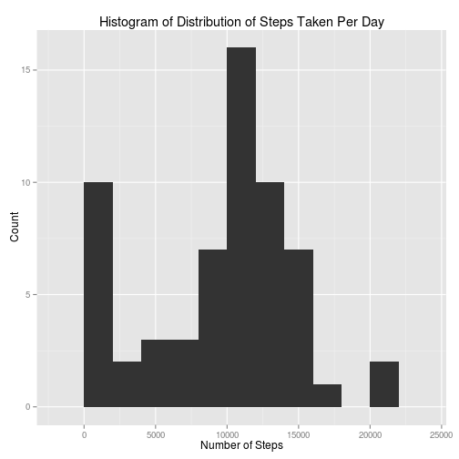
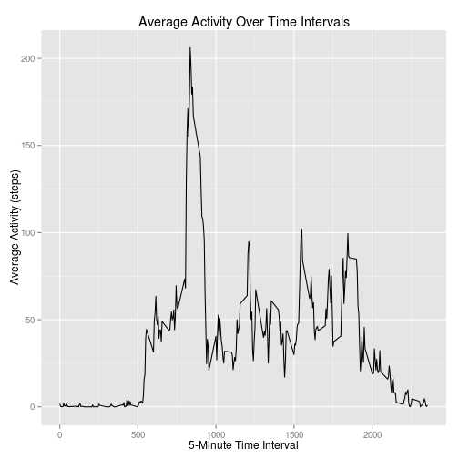
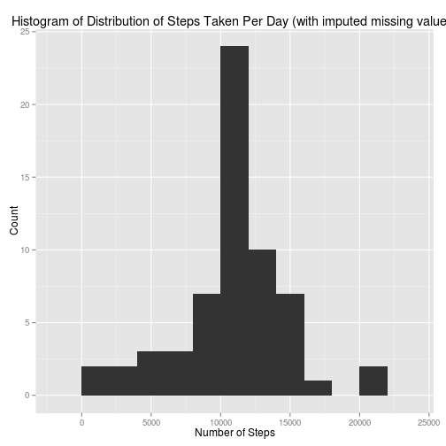
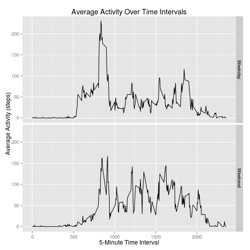

## Loading and preprocessing the data

The following libraries will be used to complete this analysis:


```r
library(dplyr)
library(lubridate)
library(ggplot2)
```

We begin by loading the tracker data. This data is in a clean CSV, and we load it 
straight from the compressed data file provided. We also parse the dates into proper
dates at this point.


```r
data <- read.csv(unz("activity.zip", "activity.csv"), stringsAsFactors = FALSE)
data$date <- ymd(data$date)
```

## What is mean total number of steps taken per day?

We are interested in the number of steps taken every day. In this case, it's acceptable to
ignore missing values, so we do so. For the days where there are NO values, we will still 
count "zero steps per day." While this is less accurate than "ignoring those days entirely"
would be, it is also more stable, because the addition/change of a single data point is not
likely to perturn the final result.

We compute a basic data frame of days to steps-per-day, and show what the data look like in 
a histogram. We also compute the median and the mean.


```r
# Function to compute steps-per-day aggregate
aggregateStepsPerDay <- function(raw_data) {
    raw_data %>% 
        select(date, steps) %>% 
        group_by(date) %>% 
        summarise_each(funs(sum(., na.rm = TRUE)))
}

# Compute number of steps per day.
steps_per_day <- aggregateStepsPerDay(data)

# Compute the mean and median
mean_steps_per_day <- mean(steps_per_day$steps)
median_steps_per_day <- median(steps_per_day$steps)

# Plot histogram of number of steps per day.
ggplot(data = steps_per_day, aes(x=steps)) + geom_histogram(binwidth = 2000) + 
    labs(x = "Number of Steps", y = "Count") +
    labs(title = "Histogram of Distribution of Steps Taken Per Day")
```

 

The median and mean are:
- Mean steps per day: 9354.23
- Median steps per day: 10395


## What is the average daily activity pattern?

We now compute the average activity pattern across all days, by interval. This will show, on average,
at what time of the day our subject is most active.


```r
# Compute average steps per interval
avg_steps_per_interval <- data %>% 
                         select(interval, steps) %>% 
                         group_by(interval) %>% 
                         summarise_each(funs(mean(., na.rm = TRUE)))

# Compute interval with the max activity on average.
max_avg_activity_interval_value <- max(avg_steps_per_interval$steps)
max_avg_activity_interval <- avg_steps_per_interval[which.max(avg_steps_per_interval$steps), ]$interval

# Plot the result, showing average time over the day
ggplot(data = avg_steps_per_interval, aes(interval, steps)) + geom_line() +
    labs(x = "5-Minute Time Interval", y = "Average Activity (steps)") +
    labs(title = "Average Activity Over Time Intervals")
```

 

The interval with the max activity is 835, with 206.17 steps.


## Imputing missing values

There are a number of missing values in the data set. In this section, we look into the situation, and see how robust our 
previous analysis was, where we ignored all missing values.

The data set contains 2304 missing values.

We will impute the missing values by substituting in the mean for that 5-minute interval, which we've 
already calculated above.


```r
# Impute the values, as follows:
# 1) Left-join with the average steps per interval data, on interval. This will split "steps" into 
#    "steps.x" and "steps.y"
# 2) Create a new value "steps", which will be equal to "steps.x" if it's defined, and "steps.y" if 
#    "steps.x" is NA.
# 3) Drop the interstitial "steps.x" and "steps.y" variables.
imputed_data <- left_join(data, avg_steps_per_interval, by = "interval") %>% 
                mutate(steps = ifelse(is.na(steps.x), steps.y, steps.x)) %>% 
                select(steps, date, interval)
```

Now, recalculate the total steps per day, along with the mean and median, so we can compare to the old results.


```r
# Compute number of steps per day.
imputed_steps_per_day <- aggregateStepsPerDay(imputed_data)

# Compute the mean and median
imputed_mean_steps_per_day <- mean(imputed_steps_per_day$steps)
imputed_median_steps_per_day <- median(imputed_steps_per_day$steps)

# Plot histogram of number of steps per day.
ggplot(data = imputed_steps_per_day, aes(x=steps)) + geom_histogram(binwidth = 2000) + 
    labs(x = "Number of Steps", y = "Count") +
    labs(title = "Histogram of Distribution of Steps Taken Per Day (with imputed missing values)")
```

 

The new median and mean are:
- Imputed mean steps per day: 10766.19
- Imputed median steps per day: 10766.19

Recall the original values, for comparison:
- Original mean steps per day (from earlier): 9354.23
- Original median steps per day (from earlier): 10395


## Are there differences in activity patterns between weekdays and weekends?

To separate out weekends from weekdays, we add a factor to represent whether the day in question is a weekday.


```r
weekdayFactor <- function(date) {
    as.factor(
        ifelse(
            weekdays(date) %in% c("Saturday", "Sunday"), 
            "Weekend",
            "Weekday"
        )
    )
}

imputed_data$weekday <- weekdayFactor(imputed_data$date)
```

To quickly visualize the differences (if any) between weekday and weekend activity, we plot average activity 
across all days, for each interval, split by weekday/weekend levels.


```r
# Compute average steps per interval, by weekday
weekday_avg_steps_per_interval <- imputed_data %>% 
                                  select(interval, weekday, steps) %>% 
                                  group_by(interval, weekday) %>% 
                                  summarise_each(funs(mean))

# Plot the result, showing average time over the day
ggplot(data = weekday_avg_steps_per_interval, aes(interval, steps)) + geom_line() +
    facet_grid(weekday ~ .) +
    labs(x = "5-Minute Time Interval", y = "Average Activity (steps)") +
    labs(title = "Average Activity Over Time Intervals")
```

 


